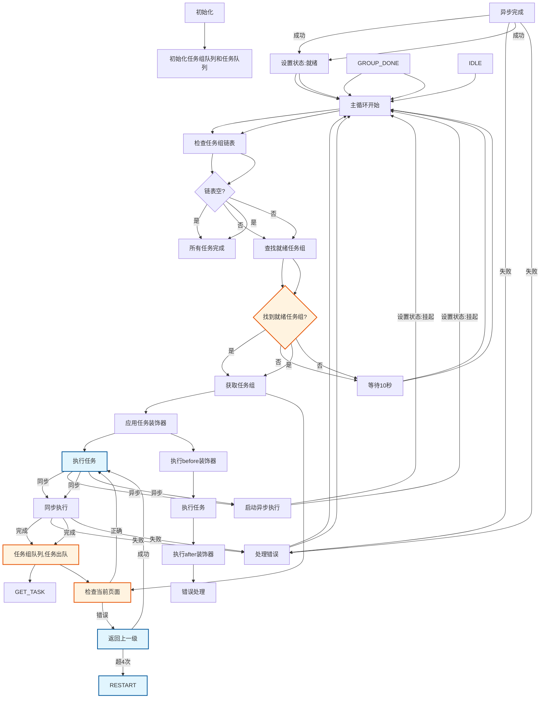
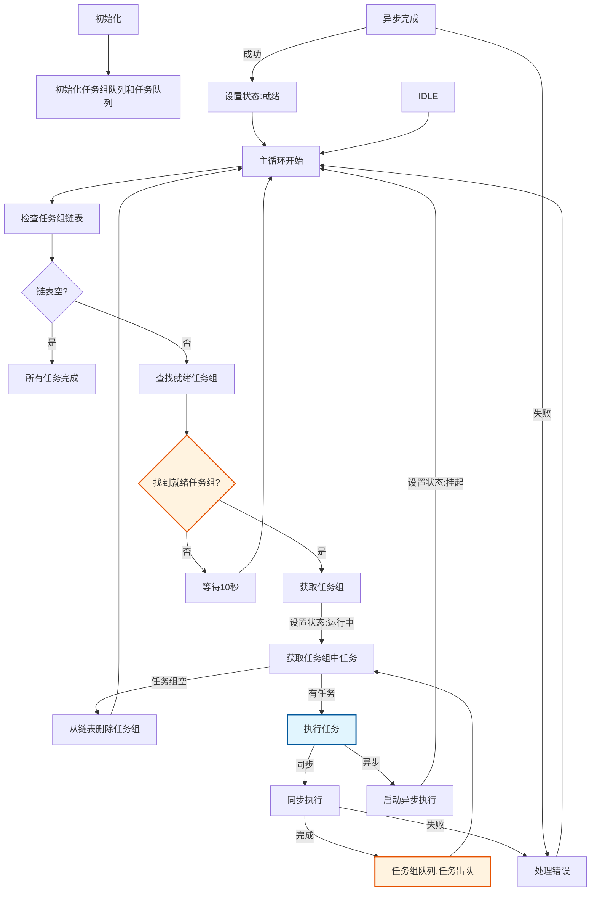

## 1. 整体架构

### 1.1 核心组件

1. **任务配置系统**
   - JSON格式的任务配置文件
   - 包含应用信息、全局配置、任务组和任务定义
   - 支持继承和覆盖配置
   - 任务配置与代码完全分离

2. **任务解析器**
   - 解析JSON配置文件
   - 构建任务对象模型
   - 处理配置继承关系
   - 验证配置有效性

3. **任务执行引擎**
   - 驱动状态机运行
   - 管理任务调度
   - 处理异步操作
   - 错误恢复
   - 支持插件化扩展
   - 运行时动态加载新任务类型

4. **设备操作SDK**
   - 封装所有与设备交互的操作
   - 支持点击、滑动、等待等基础操作
   - 提供页面导航能力
   - 处理权限和弹窗
   - 操作类型可插拔
   - 支持自定义扩展

5. **辅助组件**
   - **DialogHandler**：弹窗处理中心
   - **ErrorHandler**：错误处理与恢复
   - **TaskDependencyManager**：任务依赖管理
   - **StatePersistence**：状态持久化

#### 高内聚低耦合设计

1. **配置与代码分离**
   - 所有任务逻辑通过JSON配置定义
   - 代码只提供基础操作能力
   - 任务扩展只需修改JSON配置
   - 配置变更不影响代码

2. **插件化架构**
   - 操作类型可插拔设计
   - 支持动态加载新操作类型
   - 每个操作类型独立实现
   - 不同操作类型互不影响

3. **任务类型扩展**
   - 新增任务类型只需添加配置
   - 操作类型独立实现
   - 支持自定义操作
   - 可以复用现有操作

#### 代码架构设计

1. **基础操作层**
   - 封装所有基础操作
   - 每个操作独立实现
   - 提供统一接口
   - 操作结果标准化

2. **任务执行层**
   - 解析配置文件
   - 构建任务模型
   - 管理任务状态
   - 处理任务依赖

3. **扩展支持层**
   - 操作类型注册
   - 动态加载机制
   - 插件管理
   - 自定义扩展点

#### 开闭原则实现

1. **操作类型扩展**
   ```kotlin
   // 基础操作接口
   interface Operation {
       fun execute(params: Map<String, Any>): OperationResult
       fun validate(params: Map<String, Any>): Boolean
   }
   
   // 基础实现类
   abstract class BaseOperation : Operation {
       override fun validate(params: Map<String, Any>): Boolean {
           // 默认验证逻辑
           return true
       }
   }
   
   // 具体实现
   class ClickTextOperation : BaseOperation() {
       override fun execute(params: Map<String, Any>): OperationResult {
           // 点击文本的具体实现
           return OperationResult.SUCCESS
       }
   }
   ```

2. **操作注册机制**
   ```kotlin
   // 操作注册器
   object OperationRegistry {
       private val operations = mutableMapOf<String, Class<out Operation>>()
       
       fun register(type: String, clazz: Class<out Operation>) {
           operations[type] = clazz
       }
       
       fun getOperation(type: String): Operation {
           return operations[type]?.newInstance() ?: throw IllegalArgumentException("Unknown operation type")
       }
   }
   ```

3. **任务解析器设计**
   ```kotlin
   class TaskParser {
       fun parse(taskConfig: Map<String, Any>): Task {
           val type = taskConfig["type"] as String
           val operation = OperationRegistry.getOperation(type)
           // 构建任务对象
           return Task(operation, taskConfig)
       }
   }
   ```

#### 扩展示例：添加新操作类型

1. **定义新接口**
   ```kotlin
   interface CustomOperation : Operation {
       fun customMethod(): Unit
   }
   ```

2. **实现新操作**
   ```kotlin
   class CustomOperationImpl : BaseOperation(), CustomOperation {
       override fun customMethod() {
           // 自定义方法实现
       }
       
       override fun execute(params: Map<String, Any>): OperationResult {
           customMethod()
           return OperationResult.SUCCESS
       }
   }
   ```

3. **注册新操作**
   ```kotlin
   OperationRegistry.register("custom_operation", CustomOperationImpl::class.java)
   ```

4. **配置使用**
   ```json
   {
     "task": {
       "type": "custom_operation",
       "params": {
         "param1": "value1"
       }
     }
   }
   ```

#### 设计要点

1. **接口隔离**
   - 每个操作类型实现独立接口
   - 接口定义清晰，职责单一
   - 不影响其他操作类型

2. **依赖注入**
   - 通过注册器获取具体实现
   - 不直接依赖具体类
   - 支持运行时替换实现

3. **配置驱动**
   - 扩展功能通过配置启用
   - 不需要修改现有代码
   - 支持热更新

4. **模块化设计**
   - 每个功能模块独立
   - 可以单独扩展
   - 不影响其他模块


#### 任务配置结构

```json
{
  "app": {  // 应用信息
    "pkg": "应用包名",
    "name": "应用名称",
    "main_activity": "主Activity"
  },
  "config": {  // 全局配置
    "globals": {  // 全局参数
      "timeout": 10000,
      "swipe_duration": 500,
      "retry_count": 3
    },
    "task_group_defaults": {  // 任务组默认配置
      "enabled": true,
      "level": 1,
      "wait_after": 1000
    },
    "task_defaults": {  // 任务默认配置
      "enabled": true,
      "wait_after": 1000,
      "timeout": 3600000,
      "retry": 3,
      "repeat": 1
    }
  },
  "task_groups": [  // 任务组列表
    {
      "name": "任务组名称",
      "desc": "任务组描述",
      "level": 1,
      "tasks": [  // 任务列表
        {
          "name": "任务名称",
          "desc": "任务描述",
          "type": "操作类型",
          "params": {}  // 操作参数
        }
      ]
    }
  ]
}
```

#### 配置解析流程

1. **配置加载**
   - 读取JSON配置文件
   - 验证JSON格式
   - 解析应用信息

2. **配置解析**
   - 解析全局配置
   - 处理配置继承
   - 构建任务组模型
   - 构建任务模型

3. **配置验证**
   - 验证参数类型
   - 验证参数范围
   - 检查依赖关系
   - 验证操作可行性

4. **配置优化**
   - 合并重复配置
   - 优化执行顺序
   - 处理条件分支
   - 添加错误处理


## 2. 核心流程

### 2.1 任务调度系统核心设计

#### 系统架构

任务调度系统采用分层设计，主要包含以下核心组件：
- **任务组链表**：双向链表结构，用于高效地管理和遍历任务组
  - 每个节点包含一个任务组
  - 支持O(1)时间复杂度的插入和删除操作
  - 允许高效地遍历和查找就绪状态的任务组
- **任务组**：
  - 包含一个任务队列，管理组内的具体任务
  - 维护任务组状态（就绪、运行中、挂起）
  - 记录任务组的相关元数据和执行上下文
- **调度器**：
  - 负责任务组的调度和执行
  - 处理任务组状态转换
  - 管理异步任务的挂起和恢复

#### 核心流程

##### 1. 初始化阶段
- 初始化任务组链表
- 加载并解析任务配置
- 构建任务依赖关系

##### 2. 主调度循环
1. **队列状态检查**
   - 检查任务组链表是否为空
   - 如果链表为空，表示所有任务完成，结束调度
   - 如果链表不为空，遍历链表查找`就绪`状态的任务组

2. **任务组执行**
   - 找到第一个`就绪`状态的任务组
   - 设置任务组状态为`运行中`
   - 执行该任务组
   - 如果任务组执行完成，从链表中移除
   - 如果没有找到`就绪`状态的任务组，等待10秒后重试

3. **任务执行**
   - 获取任务组中的下一个任务
   - 根据任务类型执行：
     - **同步任务**：立即执行并等待完成
     - **异步任务**：
       1. 设置任务组状态为"挂起"
       2. 将任务组移到队尾
       3. 启动异步执行
       4. 异步完成后设置任务组状态为"就绪"

4. **任务组完成**
   - 当任务组中所有任务执行完毕
   - 将任务组从链表中移除

#### 关键设计

##### 任务组状态管理
- **就绪**：任务组可以立即执行
- **运行中**：任务组正在执行
- **挂起**：任务组中有异步任务正在执行

##### 异步任务处理
- 异步任务执行时，其所在任务组会被挂起
- 异步任务完成后，任务组状态恢复为就绪

##### 错误处理
- 同步/异步任务执行失败都会进入错误处理流程
- 错误处理后继续主循环，避免系统挂起

#### 优势

1. **高效调度**：通过状态管理和队列操作，实现任务的高效调度
2. **资源优化**：异步任务不会阻塞主循环，提高系统吞吐量
3. **状态清晰**：明确的任务组状态流转，便于调试和维护
4. **容错性**：完善的错误处理机制，确保系统稳定性
5. **扩展性**：支持动态添加任务组，适应不同场景需求
6. **页面独立性**：通过环境初始化确保每个任务组从主页开始执行，降低任务组间的耦合性

#### 任务装饰器设计

1. **环境初始化装饰器**
   - 包装每个任务执行前的环境准备
   - 确保任务在正确的页面上下文中执行
   - 支持自定义初始化逻辑

2. **装饰器实现**
   ```kotlin
   abstract class TaskDecorator(protected val task: Task) : Task {
       override fun execute() {
           beforeExecute()
           try {
               task.execute()
               afterExecute()
           } catch (e: Exception) {
               onError(e)
               throw e
           }
       }
       
       protected open fun beforeExecute() {}
       protected open fun afterExecute() {}
       protected open fun onError(e: Exception) {}
   }

   class EnvironmentInitializerDecorator(task: Task, private val config: TaskConfig) : TaskDecorator(task) {
       override fun beforeExecute() {
           ensureHomePage()
       }
       
       private fun ensureHomePage() {
           val homePage = config.getHomePage()
           if (!isCurrentPage(homePage)) {
               navigateToHomePage(homePage)
           }
       }
       
       private fun navigateToHomePage(homePage: String) {
           var backCount = 0
           while (!isCurrentPage(homePage) && backCount <= 4) {
               pressBack()
               backCount++
           }
           
           if (!isCurrentPage(homePage)) {
               restartApp()
               // 重新尝试导航到主页
               ensureHomePage()
           }
       }
   }
   ```

3. **装饰器使用**
   - 在任务执行时自动应用装饰器
   - 支持链式调用多个装饰器
   - 可配置是否启用特定装饰器

4. **配置集成**
   - 在任务配置中定义装饰器
   - 支持装饰器参数配置
   - 可扩展新的装饰器类型

3. **页面监控**
   - 通过onAccessibilityEvent监听页面变化
   - 当检测到不在当前应用时，触发应用重启流程
   - 记录页面切换历史，用于调试和错误分析

4. **错误恢复策略**
   - 页面导航超时：4次返回未成功
   - 应用切换错误：检测到不在目标应用
   - 任务执行失败：记录错误日志并重试
   - 最终失败：关闭应用并重新开始

#### 核心流程图更新



#### 状态转换详解

1. **任务组状态转换**
   - `就绪` -> `运行中`：当任务组被调度执行时
   - `运行中` -> `挂起`：当任务组中的异步任务开始执行时
   - `挂起` -> `就绪`：当异步任务执行完成时
   - `运行中` -> `完成`：当任务组中所有任务执行完毕时

2. **任务状态**
   - `等待中`：任务在队列中等待执行
   - `执行中`：任务正在执行
   - `已完成`：任务执行成功
   - `已失败`：任务执行失败

#### 任务组管理

1. **任务组创建**
   - 解析配置文件创建任务组
   - 初始化任务组内任务队列
   - 设置任务组初始状态为`就绪`

2. **任务组调度**
   - 使用双向链表管理任务组
   - 遍历链表执行第一个`就绪`状态的任务组
   - 任务组执行完成后从链表中移除
   - 当所有任务组都处于`挂起`状态时，等待10秒后重试

3. **任务执行控制**
   - 同步任务：阻塞执行，直到任务完成
   - 异步任务：非阻塞执行，任务组状态变为`挂起`
   - 任务超时：设置合理的超时时间，防止任务长时间占用资源

#### 异常处理机制

1. **任务执行异常**
   - 记录详细的错误日志
   - 根据配置决定是否重试
   - 超过最大重试次数后标记任务为`已失败`

2. **系统异常**
   - 捕获未处理的异常
   - 记录错误现场信息
   - 尝试恢复系统到稳定状态
   - 通知管理员处理

3. **资源释放**
   - 确保任务执行完成后释放占用的资源
   - 处理任务取消和中断
   - 清理超时任务

### 2.2 任务调度与执行流程图

